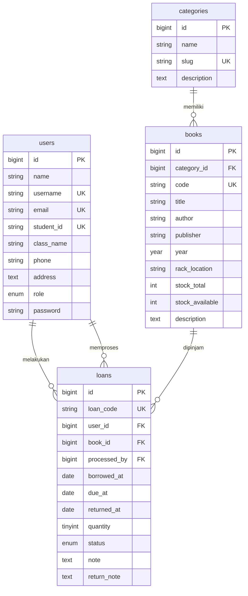

# ERD Aplikasi Peminjaman Buku

```mermaid
erDiagram
    users ||--o{ loans : melakukan
    users ||--o{ loans : memproses
    categories ||--o{ books : memiliki
    books ||--o{ loans : dipinjam

    users {
        bigint id PK
        string name
        string username UK
        string email UK
        string student_id UK
        string class_name
        string phone
        text address
        enum role
        string password
    }

    categories {
        bigint id PK
        string name
        string slug UK
        text description
    }

    books {
        bigint id PK
        bigint category_id FK
        string code UK
        string title
        string author
        string publisher
        year year
        string rack_location
        int stock_total
        int stock_available
        text description
    }

    loans {
        bigint id PK
        string loan_code UK
        bigint user_id FK
        bigint book_id FK
        bigint processed_by FK
        date borrowed_at
        date due_at
        date returned_at
        tinyint quantity
        enum status
        text note
        text return_note
    }
```
